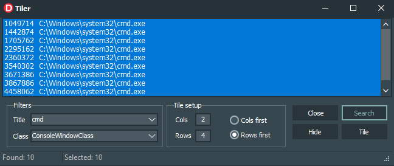
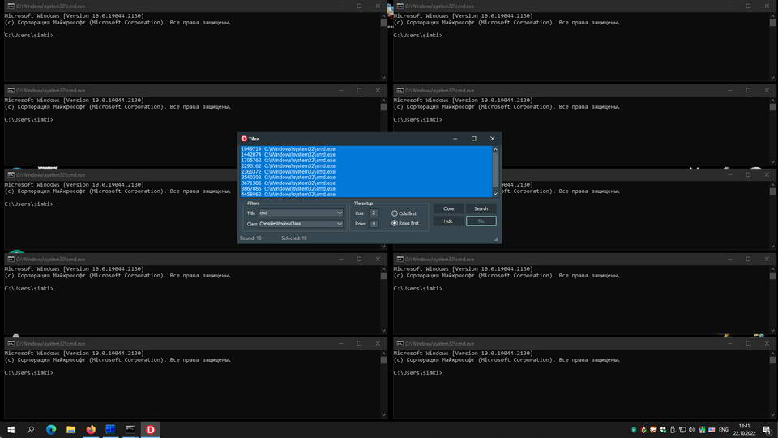

Simple and lightweight windows manager for Windows written in Delphi.

Very useful if you have many console windows.

### Features
* Search windows by part of their title
* Tile selected windows by pattern
* Hide selected windows
* Close selected windows
* Customize search parameters

### Installation
Not required.
Just put 'Tiler.exe' and 'Tiler.ini' together.

### Licence
Freeware
